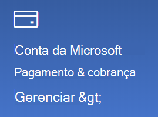

# Alterar as informações da minha conta MicrosoftChange my Microsoft account information

Vá para [https://account.microsoft.com](https://account.microsoft.com/) e entre, se necessário.Go to [https://account.microsoft.com](https://account.microsoft.com/) and sign in if necessary. Você será direcionado para o painel da sua conta.This will take you to your account dashboard.  

**Editar meu nome e informações pessoais****Edit my name and personal information**

1. No painel da sua conta, ao lado da imagem e nome da conta, clique nos três pontos (mais ações) > Editar perfil\*\*.On your account dashboard, next to your account picture and name, click the three dots (more actions) > Edit profile\*\*.
2. Na página **Editar perfil**, use os links fornecidos para alterar a sua imagem de perfil, nome, data de nascimento, local e a preferência de idioma de exibição.On the **Edit profile** page, use the links provided to change your profile picture, name, date of birth, location, and display language preference. Anote os links para os perfis da conta do Xbox ou do Skype, em que você pode alterar os detalhes específicos das contas.Note the links to your Xbox or Skype account profiles, where you can change details specific to these accounts.

**Gerencie endereços de e-mail e números de telefone****Manage e-mail addresses and phone numbers**

Uma conta Microsoft tem um ou mais endereços de email, ou números de telefone associados a ele como "aliases". Para gerenciar isso:A Microsoft account has one or more e-mail addresses or phone numbers associated with it as “aliases.” To manage these:

1. No painel da sua conta, ao lado da imagem e nome da conta, clique nos três pontos (mais ações) > **Editar perfil**.On your account dashboard, next to your account picture and name, click the three dots (more actions) > **Edit profile**.
2. Na página **Editar perfil**, clique em **Gerenciar como entrar na Microsoft**.On the **Edit profile** page, click **Manage how you sign in to Microsoft**. 
3. Você verá uma lista de alias de conta e poderá gerenciar a lista, incluindo adicionar e excluir endereços de email e números de telefone.You will see a list of account aliases, and you can manage the list, including adding and deleting e-mail addresses and phone numbers. Aqui você também pode selecionar quais aliases podem ser usados para entrar na conta e qual alias é considerado "principal", que será exibido em seus dispositivos Windows 10.Here you can also select which aliases can be used to sign in to the account, and which alias is considered “primary,” which will be displayed on your Windows 10 devices.

**Gerenciar métodos de pagamento, bem como nome e endereço para cobrança****Manage payment methods, as well as name and address for billing** 

1. No painel da sua conta, ao lado da imagem e nome da conta, clique nos três pontos (mais ações) > **Editar perfil**.On your account dashboard, next to your account picture and name, click the three dots (more actions) > **Edit profile**.
2. Em **Pagamento e cobrança** clique em **Gerenciar**.Under **Payment & billing** click **Manage**.

    

3. Aqui você pode adicionar, editar e remover os métodos de pagamento e os endereços de cobrança associados.Here you can add, edit, and remove payment methods and their associated billing addresses. 
