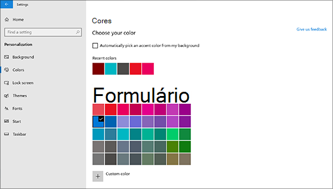
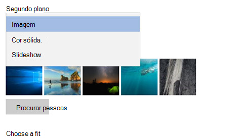

# Alterar o plano de fundo e as cores da área de trabalhoChange your desktop background and colors

Para alterar a configuração de cores, vá para **Iniciar**  >  **as**  >  **Personalization**  >  **cores**de personalização e escolha sua própria cor ou deixe que o Windows retire uma cor de destaque do plano de fundo.To change your colors setting, go to **Start** > **Settings** > **Personalization** > **Colors**, and then choose your own color or let Windows pull an accent color from your background.

Para alterar o plano de fundo da área de trabalho, vá para **Iniciar**  >  **configurações**  >  de**personalização**  >  do**plano de fundo**e escolha uma imagem, uma cor sólida ou crie uma apresentação de slides de imagens.To change your desktop background, go to **Start** > **Settings** > **Personalization** > **Background**, and then choose a picture, solid color, or create a slideshow of pictures. 

Quer mais cores e planos de fundo da área de trabalho?Want more desktop backgrounds and colors? Visite a [Microsoft Store](https://www.microsoft.com/store/collections/windowsthemes) para escolher dentre dezenas de temas gratuitos.Visit [Microsoft Store](https://www.microsoft.com/store/collections/windowsthemes) to choose from dozens of free themes.
