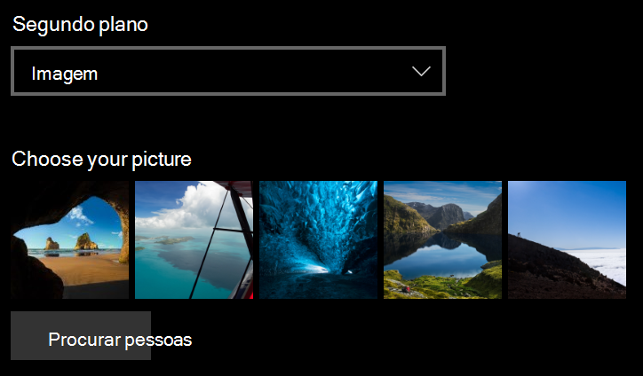
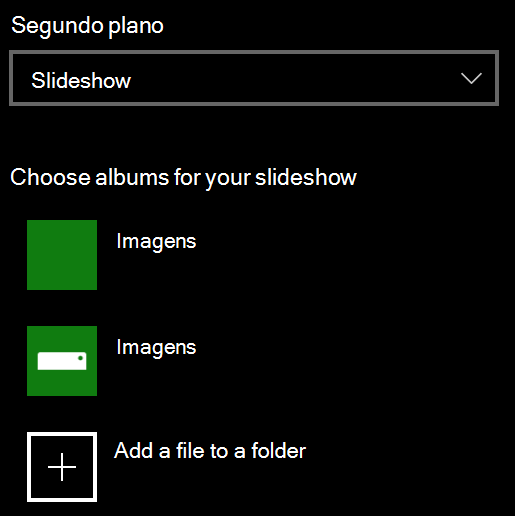

# Alterar o plano de fundo da tela de bloqueio

- Vá para **Settings**  >  **Personalization**  >  **tela bloqueio**de personalização de configurações. Ou clique ou toque [aqui](ms-settings:lockscreen?activationSource=GetHelp).

- Para definir uma imagem de plano de fundo personalizada, selecione **imagem** na lista suspensa **plano de fundo** e escolha ou **navegue** até a imagem.

  

- Para configurar uma apresentação de slides de imagens personalizadas, selecione **apresentação de slides** na lista suspensa plano de **fundo** e escolha um álbum ou adicione uma pasta que contenha as imagens da apresentação de slides.

  
