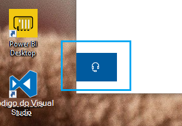

# Entre em contato conosco clicando no botão fone de ouvido

Se quiser entrar em contato com o suporte da Microsoft, clique em **Fale conosco** no canto inferior esquerdo deste aplicativo. Dentro da janela de saída, você será direcionado para o canal de suporte certo depois de escolher a categoria do produto e do problema.

Você pode manter a interação com o restante do aplicativo, mesmo depois de ter iniciado uma sessão de contato conosco. O painel fale conosco pode ser minimizado temporariamente clicando em qualquer outro lugar dentro do aplicativo. Para retornar à mesma sessão, basta clicar em **Fale conosco** novamente.
