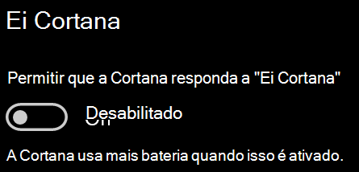

# A Cortana não me fala ou não consegue me ouvirCortana doesn’t talk to me or can’t hear me

Se você estiver tentando usar o recurso "Ei Cortana", que permite que você converse com a Cortana sem selecionar o botão da Cortana na barra de tarefas ou botão de microfone no painel Cortana, confirme se o recurso está habilitado:If you are trying to use the "Hey Cortana" feature, which allows you to talk to Cortana without selecting the Cortana button on the taskbar or the microphone button in the Cortana panel, confirm that the feature is enabled:

1. Vá para **Iniciar**, em seguida, selecione **[Configurações > Cortana](ms-settings:cortana?activationSource=GetHelp)**.Go to **Start**, then select **[Settings > Cortana](ms-settings:cortana?activationSource=GetHelp)**.
2. Em **Ei Cortana**, troque a **Permitir que a Cortana responda à "Ei Cortana"** para **Ativado**.Under **Hey Cortana**, switch the **Let Cortana respond to "Hey Cortana"** toggle to **On**.

**As suas configurações de privacidade impedem que a Cortana o ouvisse?****Are your privacy settings preventing Cortana from hearing you?**

As configurações de privacidade podem impedir que a Cortana responda à sua voz.Your privacy settings can prevent Cortana from responding to your voice.
- Verifique se o reconhecimento de fala online está habilitado:Check to make sure Online Speech recognition is turned on:
    - Vá para **Iniciar**, em seguida, clique em **[Configurações > Privacidade > Fala](ms-settings:privacy-speech?activationSource=GetHelp)**.Go to **Start**, then click **[Settings > Privacy > Speech](ms-settings:privacy-speech?activationSource=GetHelp)**.
    - Em **Reconhecimento de fala online**, alterne a configuração para **Ativado**.Under **Online speech recognition**, switch the setting to **On**.
- Verifique se a Cortana tem permissão para acessar o microfone.Check to make sure Cortana has permission to access your microphone. 
    - Vá para Iniciar, em seguida, clique em **[Configurações > Privacidade > Microfone](ms-settings:privacy-microphone?activationSource=GetHelp)**.Go to Start, then click **[Settings > Privacy > Microphone](ms-settings:privacy-microphone?activationSource=GetHelp)**.
    - Em **Escolha quais aplicativos podem acessar o microfone**, procure pela **Cortana** dentro da lista de aplicativos e serviços, e verifique se a opção está no modo **Ativado**.Under **Choose which apps can access your microphone**, look for **Cortana** within the list of apps and services and make sure the switch is toggled to **On**.

Além disso, certifique-se de que os alto-falantes ou microfones estão funcionando, para conversar com a Cortana.Moreover, please also make sure that your speakers or microphones are up and working in order to talk to Cortana.
