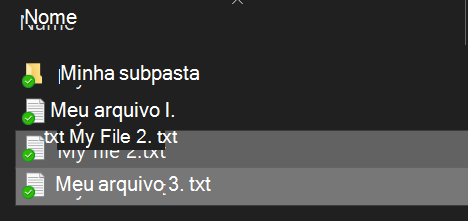
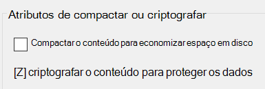

# Criptografar arquivos ou pasta no Windows 10Encrypt files or folder in Windows 10

Você pode criptografar um disco inteiro usando o BitLocker, mas para criptografar apenas arquivos ou pastas individuais (e seu conteúdo):You can encrypt an entire disk using BitLocker, but to encrypt only individual files or folders (and their contents):

1. No **Explorador de arquivos**, selecione o(s) arquivo(s) que você quer criptografar.In **File Explorer**, select the file(s)/folder(s) you want to encrypt. Nesse exemplo, dois arquivos foram selecionados:In this example, two files have been selected:

    

2. Clique com o botão direito do mouse no arquivo zip e clique em **Propriedades**.Right-click the selected files and click **Properties**.

3. Na janela **Propriedades**, clique em **Advançar**.In the **Properties** window, click **Advanced**.

4. Na janela **Propriedades avançadas**, clique na caixa de seleção **Criptografar o conteúdo para proteger os dados**:In the **Advanced Properties** window, select the **Encrypt contents to secure data** checkbox:

    

5. Clique em **OK**.Click **OK**.
