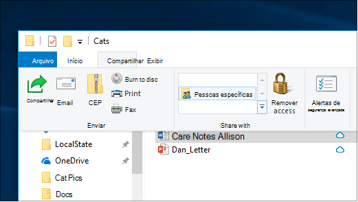
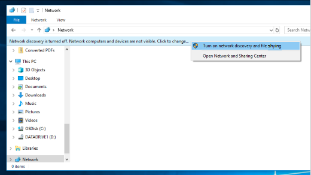

# Compartilhamento de arquivos em uma rede no Windows 10

**Observação**: se você tiver usado o grupo doméstico anteriormente para compartilhamento de arquivos, observe que o grupo doméstico foi removido do Windows 10 (versão 1803). Agora você pode compartilhar impressoras e arquivos usando recursos internos no Windows 10.

**Para compartilhar arquivos ou pastas em uma rede**

- No **Explorador de arquivos**, selecione um arquivo > clique na guia **compartilhar** na > superior da seção **compartilhar com** , clique em **pessoas específicas**.

    
          
- Se você selecionar vários arquivos ao mesmo tempo, você pode compartilhá-los todos da mesma maneira. Ele também funciona para pastas.

**Para ver os dispositivos na rede que estão compartilhando arquivos**

- No **Explorador de arquivos**, vá para **rede**. Se a descoberta de rede não estiver habilitada, você verá uma mensagem de erro "a descoberta de rede está desativada..."

- Clique em a **descoberta de rede está desativada** e, em seguida, clique em **ativar a descoberta de rede e o compartilhamento de arquivos**.

    

[Leia mais sobre compartilhamento de arquivos em uma rede](https://support.microsoft.com/help/4092694/windows-10-file-sharing-over-a-network)

[Compartilhar arquivos usando aplicativos, OneDrive, emails e muito mais](https://support.microsoft.com/help/4027674/windows-10-share-files-in-file-explorer)
