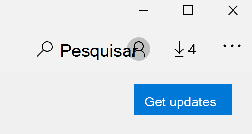

# Corrigir o idioma de exibição dos aplicativos

Depois de alterar o idioma de exibição no Windows 10, alguns aplicativos ainda podem usar o idioma anterior ao abri-los. Isso acontece porque novas versões dos aplicativos para esse idioma devem ser baixadas da loja. Para corrigir esse problema, você pode aguardar a atualização automática ou pode instalar manualmente a versão atualizada dos aplicativos.

Para instalar manualmente a atualização, abra o **Microsoft Store** e clique em **downloads e atualizações** no canto superior direito. Em seguida, clique em **Atualizar.** Se o idioma não for alterado após a conclusão da atualização, tente reiniciar o computador.

Para ler mais sobre as configurações de idioma de entrada e exibição, confira [gerenciar as configurações de idioma de entrada e exibição no Windows 10](https://support.microsoft.com/help/4027670/windows-10-add-and-switch-input-and-display-language-preferences).
