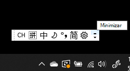
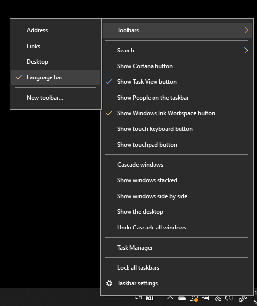
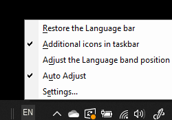

# Ocultar, exibir ou redefinir a barra de idiomasHide, display, or reset the language bar

**Para minimizar a barra de idiomas:****To minimize the language bar:**

Você pode clicar no botão minimizar no canto superior direito da barra de idiomas.You can click the minimize button on the top right corner of the language bar. Ou você pode arrastar a barra de idiomas para a barra de tarefas, o que o minimizará automaticamente.Or, you can just drag the language bar to the task bar, which will automatically minimize it.

**Para exibir a barra de idiomas:****To pop out the language bar:**

Caso não queira ancorar a barra de idiomas na barra de tarefas, clique com o botão direito do mouse em qualquer espaço vazio na barra de tarefas e desmarque a opção **Barra de idiomas** no menu Barra de ferramentas.If you don't want to dock the language bar in the taskbar, right-click any empty space in the taskbar, and uncheck the **Language bar** option in the Toolbars menu. Isso fará com que a barra de idiomas apareça fora da barra de tarefas, assim como a captura de tela anterior.This will make the language bar appear outside the taskbar, just like the previous screenshot.

**Para restaurar a barra de idiomas ao padrão:****To restore the language bar to default:**

Clique com o botão direito do mouse na barra de ferramentas e clique na opção **Restaurar a barra de idiomas** no menu.Right-click the language button in the toolbar, and click **Restore the language bar** option in the menu. Isso restaurará ao padrão.This will restore it to default.

