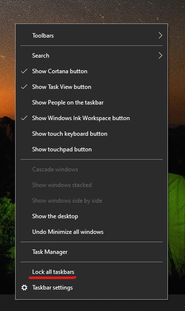

# Mova a barra de tarefas para o lado ou a parte superior da área de trabalho

Primeiro, confirme se a barra de tarefas está desbloqueada. Para saber se a sua está desbloqueada, clique com o botão direito do mouse em qualquer espaço vazio na barra de tarefas e veja se **Bloquear a barra de tarefas** possui uma marca de seleção ao lado dela. Se houver uma marca de seleção, a barra de tarefas está bloqueada e não pode ser movida. Clicar em **Bloquear a barra de tarefas** uma vez irá desbloqueá-la e remover a marca de seleção.

Caso você tenha vários monitores que exibam a barra de tarefas, você verá **Bloquear todas as barras de tarefas**.

Depois que a barra de tarefas estiver desbloqueada, você pode pressionar e segurar qualquer espaço vazio na barra de tarefas e arrastá-lo para o local desejado na tela. Você também pode fazer isso clicando com o botão direito do mouse em qualquer espaço vazio na barra de tarefas e acessando **[Configurações da barra de tarefas](ms-settings:taskbar?activationSource=GetHelp) > Local da barra de tarefas na tela**.
