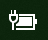
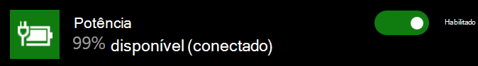

# Ícone de energia ou bateria ausente no Windows 10Power or battery icon missing in Windows 10

Se o seu dispositivo Windows 10 tiver uma bateria (por exemplo, um laptop ou tablet ou um PC conectado por meio de USB a um no-break), normalmente um ícone de alimentação/bateria será mostrado na barra de tarefas próximo ao relógio, por exemplo:If your Windows 10 device has a battery (e.g., laptop or tablet, or a PC connected via USB to a UPS), normally a power/battery icon is shown in the taskbar near the clock, for example:

Se você não vir esse ícone, ela poderá estar oculto:If you don't see this icon, it may be hidden:

1. Vá para **[Configurações > Personalização > Barra de Tarefas](ms-settings:taskbar?activationSource=GetHelp)**.Go to **[Settings > Personalization > Taskbar](ms-settings:taskbar?activationSource=GetHelp)**.

2. Na área de notificação, clique **Selecionar quais ícones aparecem na barra de tarefas**.In the Notification area, click **Select which icons appear on the taskbar**.

3. Em seguida, localize o item **Energia** na lista e alterne a configuração para **Ativado**.Then find the **Power** item in the list and toggle its setting to **On**.

    

**Solução de Problemas****Troubleshooting**

Se você seguiu as instruções acima e o botão de alternância **Energia** fica esmaecido ou não está visível, na caixa de pesquisa da barra de tarefas, digite **gerenciador de dispositivo** e, em seguida, selecione **Gerenciador de Dispositivos** na lista de resultados.If you followed the above instructions and the **Power** toggle is greyed out or not visible, in the search box on the taskbar, type **device manager**, and then select **Device Manager** in the list of results. Em **Bateria**, clique com o botão direito do mouse na bateria do dispositivo, clique em **Desabilitar** e clique em **Sim**.Under **Batteries**, right-click the battery for your device, click **Disable**, and click **Yes**. Aguarde alguns segundos e, em seguida, clique com o botão direito do mouse na bateria e clique em **Habilitar**.Wait a few seconds, and then right-click the battery and click **Enable**. Em seguida, reinicie o dispositivo.Then restart your device.

Se você seguiu as instruções acima, mas o ícone de bateria não aparece na barra de tarefas, na caixa de pesquisa da barra de tarefas, digite **gerenciador de tarefas** e, em seguida, clique em **Gerenciador de Tarefas** na lista de resultados.If you followed the above instructions, but the battery icon does not appear on the taskbar, in the search box on the taskbar, type **task manager**, and then click **Task Manager** in the list of results. Na guia **Processos**, em **Nome**, clique com o botão direito do mouse **Explorador** e clique em **Reiniciar**.On the **Processes** tab, under **Name**, right-click **Explorer**, and then click **Restart**.
