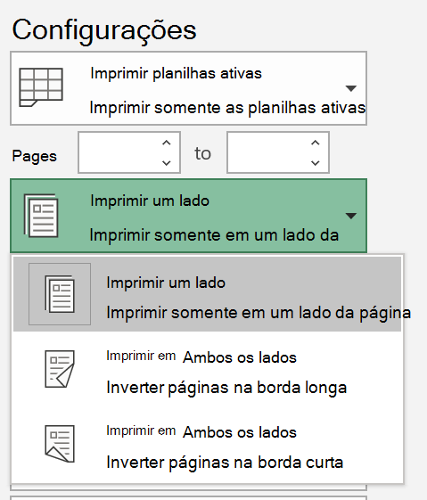
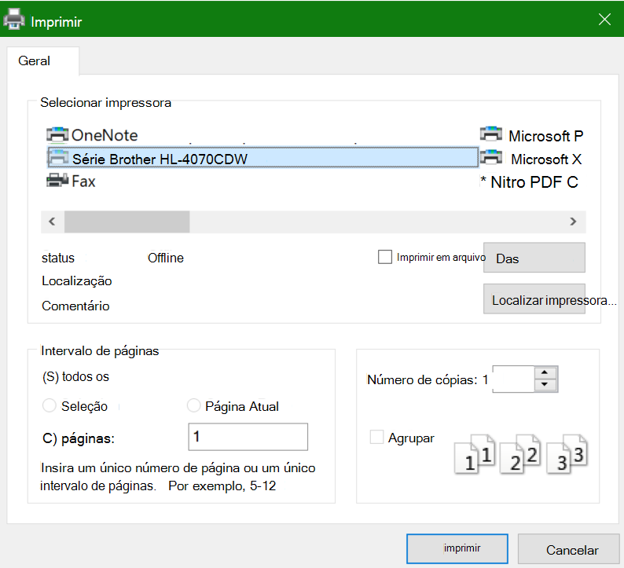

# Imprimir em ambos os lados do papel (impressão duplex)

**A minha impressora é compatível com a impressão duplex?**

O resumo ou recurso manual da sua impressora deve informar se é possível imprimir em ambos os lados do papel, também conhecido como "impressão duplex". Se você tem o Microsoft Office, outra maneira de descobrir é abrir um aplicativo do Office, como o Word ou o Excel, ir para **Arquivo > Imprimir**, verificar se a impressora certa está selecionada e procurar o recurso na seção Configurações. Por exemplo: 

**Impressão duplex no Microsoft Office**

Se a impressora for capaz de imprimir em ambos os lados, ao acessar **Arquivo > Imprimir** no aplicativo do Office, você verá uma opção para "Imprimir em Ambos os Lados", conforme mostrado no exemplo acima.  Selecione o tipo de impressão duplex desejada (virar na borda longa ou virar na borda menor) e clique em **Imprimir** para iniciar a impressão.

**Impressão duplex a partir de qualquer aplicativo**

Em muitos aplicativos ao imprimir, você verá uma caixa de diálogo de impressão geral semelhante a esta: 

Verifique se a impressora certa está selecionada e, em seguida, clique em **Preferências** para abrir a janela preferências da impressora. Se a impressora for compatível com a impressão duplex, a capacidade de habilitá-lo para o trabalho de impressão atual será exibida nessa janela.
