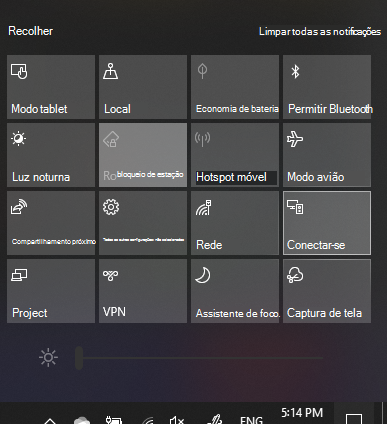

# Projetar para um PC 

Em seu dispositivo de destino (projetar para), pesquise por "Configurações de Projeção" para abrir a página de configurações de **Projeção para este computador**. Em seguida, verifique se:
- "Alguns dispositivos do Windows e do Android podem projetar neste computador quando você disser que está OK" o menu suspenso está definido para **Sempre desativado**.
- O menu suspenso "Solicitar para projetar neste computador" está definido como **Sempre que uma conexão for necessária**.
- O menu suspenso "Solicitar PIN para emparelhamento" está definido como **Nunca**.

Em seu dispositivo de destino, inicie o aplicativo **Conectar** acessando **Iniciar** e pesquise por "Conectar".

Em seguida, em seu dispositivo de origem do qual você está tentando projetar:

1. Pressione **tecla Windows + A** para abrir a Central de Ações.
2. Clique em **Conectar**.
3. Clique no dispositivo para o qual você deseja projetar a tela.

Após as etapas acima, o dispositivo de destino deve exibir a tela do dispositivo de origem como se fosse um monitor secundário.
