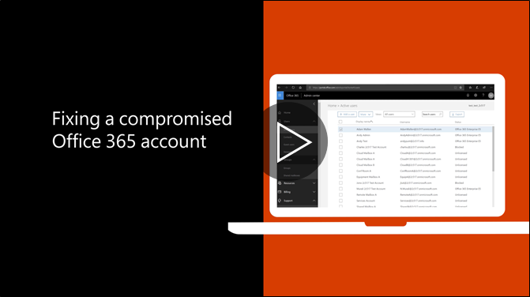

# Etapas recomendadas a ser executada se uma conta for comprometidaRecommended steps to take if an account is compromised

  
1. [Redefinir a senha do usuário](https://support.office.com/article/7a5d073b-7fae-4aa5-8f96-9ecd041aba9c) imediatamente. Não se comunicam a nova senha por email para o usuário final.[Reset the user's password](https://support.office.com/article/7a5d073b-7fae-4aa5-8f96-9ecd041aba9c) immediately. Do not communicate the new password through email to the end user. 
    
2. Remova qualquer suspeitos [encaminhamento endereços](https://support.office.com/article/ab5eb117-0f22-4fa7-a662-3a6bdb0add74) definida no nível de caixa de correio.Remove any suspicious [forwarding addresses](https://support.office.com/article/ab5eb117-0f22-4fa7-a662-3a6bdb0add74) set at the mailbox level. 
    
3. Remova qualquer suspeitos [regras de caixa de entrada](https://support.office.com/article/1433E3A0-7FB0-4999-B536-50E05CB67FED) definidas dentro da caixa de correio.Remove any suspicious [inbox rules](https://support.office.com/article/1433E3A0-7FB0-4999-B536-50E05CB67FED) set within the mailbox. 
    
4. Se o usuário seja bloqueado para o envio de email, [vá para os usuários restritos para desbloquear a conta](https://protection.office.com/?hash=/restrictedusers). Depois de concluído, o usuário poderá continuar enviando mensagens em até 1 hora.If the user is blocked from sending email, [go to the Restricted Users to unblock the account](https://protection.office.com/?hash=/restrictedusers). Once done, the user should be able to resume sending messages within 1 hour.
    
5. Remova a conta de usuário de quaisquer [grupos de função administrativa](https://support.office.com/article/eac4d046-1afd-4f1a-85fc-8219c79e1504) até que tem certeza de que a conta for comprometida não é mais.Remove the user account from any [administrative role groups](https://support.office.com/article/eac4d046-1afd-4f1a-85fc-8219c79e1504) until you are confident that the account is no longer compromised. 
    
Para minimizar o potencial de uma violação de dados ou uma conta comprometida no futuro, é recomendável ler nosso [artigo de práticas recomendado de segurança do Office 365](https://support.office.com/article/9295e396-e53d-49b9-ae9b-0b5828cdedc3).To minimize the potential of a data breach or a compromised account in the future, we recommend reading our [Office 365 Security best practices article](https://support.office.com/article/9295e396-e53d-49b9-ae9b-0b5828cdedc3).
  

