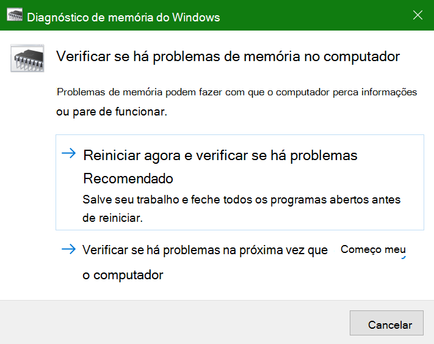
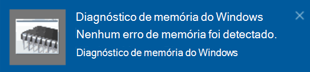

# Executar o diagnóstico de memória do Windows no Windows 10Run Windows Memory Diagnostics in Windows 10

Se o Windows e aplicativos em seu PC estiverem travando, congelando ou agindo de maneira instável, você poderá ter um problema com a memória (RAM) do PC.If Windows and apps on your PC are crashing, freezing, or acting in an unstable manner, you may have a problem with the PC’s memory (RAM). Você pode executar o diagnóstico de memória do Windows para verificar se há problemas com a RAM do PC.You can run the Windows Memory Diagnostic to check for problems with the PC’s RAM.

Na caixa de pesquisa na barra de tarefas, digite **diagnóstico de memória** e, em seguida, selecione **Diagnóstico de Memória do Windows**.In the search box on your taskbar, type **memory diagnostic**, and then select **Windows Memory Diagnostic**. 

Para executar o diagnóstico, é necessário reiniciar o PC.To run the diagnostic, the PC needs to restart. Você tem a opção de reiniciar imediatamente (salve o seu trabalho, feche os documentos e os emails abertos primeiro) ou agende o diagnóstico para ser executado automaticamente da próxima vez que o computador for reiniciado:You have the option to restart immediately (please save your work and close open documents and e-mails first), or schedule the diagnostic to run automatically the next time the PC restarts:

Quando o computador for reiniciado, o **Ferramenta de Diagnóstico de Memória do Windows** será executado automaticamente.When the PC restarts, the **Windows Memory Diagnostics Tool** will run automatically. O status e o progresso serão exibidos como a execução do diagnóstico, e você terá a opção de cancelar o diagnóstico, pressionando a tecla **ESC** no teclado.Status and progress will be displayed as the diagnostics run, and you have the option of cancelling the diagnostics by hitting the **ESC** key on your keyboard.

Quando o diagnóstico for concluído, o Windows será iniciado normalmente.When the diagnostics are complete, Windows will start normally.
Imediatamente após a reinicialização, quando a área de trabalho for exibida, uma notificação aparecerá (ao lado do ícone **Central de Ações** na barra de tarefas) para indicar se foram encontrados erros de memória.Immediately after restart, when the Desktop appears, a notification will appear (next to the **Action Center** icon on the taskbar), to indicate whether any memory errors were found. Por exemplo:For example:

Este é o ícone da Central de Ações:Here's the Action Center icon:  

E um exemplo de notificação:And a sample notification: 

Caso tenha perdido a notificação, você pode selecionar o ícone da **Central de Ações** na barra de tarefas para exibir a **Central de Ações** e ver uma lista rolável de notificações.If you missed the notification, you can select the **Action Center** icon  on the taskbar to display the **Action Center** and see a scrollable list of notifications.

Para revisar informações detalhadas, digite **evento** na caixa de pesquisa na barra de tarefas e, em seguida, selecione **Visualizar Eventos**.To review detailed information, type **event** into the search box on your taskbar, and then select **Event Viewer**. No painel esquerdo do **Visualizador de Eventos**, navegue até **Logs do Windows > Sistema**.In the **Event Viewer**’s left-hand pane, navigate to **Windows Logs > System**. No painel à direita, examine a lista olhando para a coluna **Fonte**, até que você veja os eventos com o Valor da fonte **MemoryDiagnostics-Resultados**.In the right-hand pane, scan down the list while looking at the **Source** column, until you see events with Source value **MemoryDiagnostics-Results**. Realce cada evento e veja as informações de resultado na caixa abaixo da guia **Geral** da lista.Highlight each such event and see the result information in the box under the **General** tab below the list.
