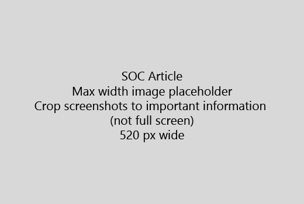

Inicie seu artigo com uma introdução muito curta (1 sentença). Colocar-se no lugar do leitor - por que são eles aqui? O que eles fazer? 
  
1. Obtenha reto a uma lista rápida das etapas para realizar a tarefa.
    
    Se você precisar explicam um conceito ou eles precisam fazer etapas de pré-requisito, adicione um resumo rápido a etapa onde precisarem e um [link](https://support.office.com/article/f37e7984-cf03-4fde-92d3-82970d7e241b.aspx) para o conceito ou as etapas abaixo. 
    
2. Mantenha procedimentos curtos - preferencialmente 5 ou menos etapas, não mais de 8.
    
3. Use o **estilo de Ui** para elementos de interface do usuário ou do texto, as pessoas precisarão inserir. 
    
4. Use os verbos escolha, selecione, ou inserir como ações e formata menus como **Menu** \> **comando**.
    
5. Opcionalmente, adicione uma captura de tela para o contexto (se a interface do usuário é difícil localizar ou ele é necessário para concluir a tarefa).
    
    Largura máxima: 520 pixels. Usar um tema padrão, não mostrar qualquer informação pessoal e cortar para mostrar apenas o que é relevante. 
    
    
  
Se você deseja adicionar um vídeo ou a captura de tela, use uma grade de duas colunas e tem as etapas em à esquerda e o vídeo ou a captura de tela no canto direito - consulte [etapas e exemplo de grade de vídeo](https://support.office.com/article/14ce8e82-efa0-47f5-bb84-94f078db3dae.aspx). 
  
Não mais de 500 palavras para um artigo de destino.
  
# Artigo de exemplo

[Alterar minha foto](https://support.office.com/article/555376e0-1fca-49ba-8434-307a0525c767.aspx)
  

