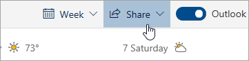

# Compartilhando com o Outlook na WebSharing with Outlook on the web

No calendário, na parte superior da página, selecione  **Compartilhar** e escolha o calendário que deseja compartilhar.From your Calendar, on the toolbar at the top of the page, select **Share**, and choose the calendar you want to share.

    

**Observação**: Você não pode compartilhar calendários pertencentes a outras pessoas.**Note**: You can't share calendars owned by other people.

- Insira o nome ou endereço de e-mail da pessoa com a qual pretende compartilhar o calendário.Enter the name or email address of the person you want to share your calendar with.
- Escolha como deseja que essa pessoa use o calendário:Choose how you want the person to use your calendar:
    - **Pode ver quando eu estou ocupado**  permite ao usuário saber quando você está ocupado, mas não inclui detalhes, como o local do evento.**Can view when I'm busy** lets them see when you're busy but doesn't include details like the event location.
    - **Pode ver títulos e locais**  permite ao usuário saber quando você está ocupado, bem como exibir o título e o local dos eventos.**Can view titles and locations** lets them see when you're busy, as well as the title and location of events.
    - **Pode ver todos os detalhes**  permite ao usuário ver todos os detalhes dos seus eventos.**Can view all details** lets them see all the details of your events.
    - **Pode editar** permite editar seu calendário.**Can edit** lets them edit your calendar.
    - **Representante**  permite aos usuários editar seu calendário e compartilhá-lo com outras pessoas.**Delegate** lets them edit your calendar and share it with others.
- Selecione  **Compartilhar**.Select **Share**.
