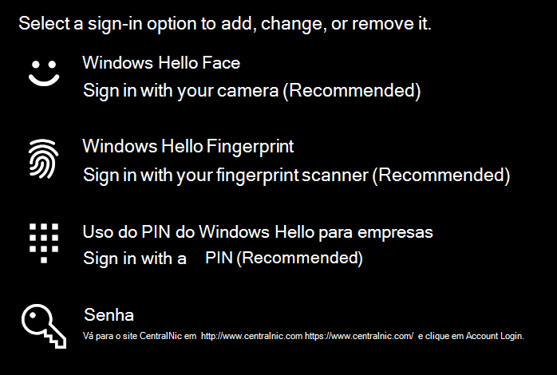
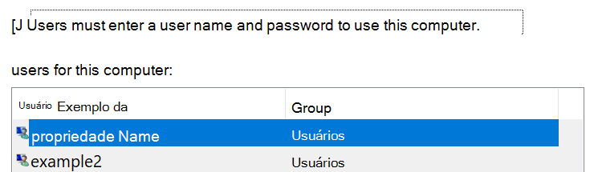

# Entrar no Windows 10 sem usar uma senhaSign-in to Windows 10 without using a password

Para evitar ter que digitar uma senha na inicialização do Windows, recomendamos que você use uma das opções de entrada segura do Windows Hello, como um PIN, um reconhecimento de face ou impressão digital, se disponível.To avoid having to type a password at Windows startup, we recommend you use one of the Windows Hello secure sign-in options, like a PIN, face recognition, or fingerprint, if available. Se você quiser desabilitar a entrada segura, consulte as instruções "entrar automaticamente no Windows 10" abaixo.If you really want to disable secure sign-in, see the "Automatically sign in to Windows 10" instructions below.

**Proteger as alternativas do Windows Hello para a senha da conta****Secure Windows Hello alternatives to the account password**

Vá até **configurações > contas > opções de entrada** (ou clique [aqui](ms-settings:signinoptions?activationSource=GetHelp)).Go to **Settings  > Accounts > Sign-in options** (or click [here](ms-settings:signinoptions?activationSource=GetHelp)). As opções de entrada disponíveis serão listadas.Available sign-in options will be listed. Por exemplo:For example:

Clique ou toque em uma das opções para configurá-la.Click or tap one of the options to configure it. Na próxima vez que iniciar ou desbloquear o Windows, você poderá usar a nova opção em vez de uma senha.Next time you start or unlock Windows, you will be able to use the new option instead of a password. 

**Entrar automaticamente no Windows 10****Automatically sign-in to Windows 10**

**Observação**: a entrada automática é conveniente, mas apresenta um risco de segurança, especialmente se o seu computador estiver acessível por várias pessoas.**Note**: Automatic sign-in is convenient, but introduces a security risk, especially if your PC is accessible by multiple people. 

1. Clique ou toque no botão **Iniciar** na barra de tarefas.Click or tap the **Start** button in the Taskbar.

2. Digite **netplwiz** e pressione a tecla Enter para abrir a janela contas de usuário.Type **netplwiz** and hit the Enter key to open the User Accounts window.

3. Em **contas de usuário**, clique na conta na qual você deseja entrar automaticamente quando o Windows for iniciado.In **User Accounts**, click the account you want to automatically sign in to when Windows starts.

4. Desmarque a caixa de seleção "os usuários devem digitar um nome de usuário e senha para usar este computador".Uncheck the "Users must enter a user name and password to use this computer" checkbox.

    

5. Clique em **OK**.Click **OK**. Você será solicitado a inserir e confirmar a senha para a conta que você selecionou.You will be asked to enter and confirm the password for the account you selected. Clique em **OK** para concluir.Click **OK** to finish. Na próxima vez que o Windows 10 for iniciado, ele entrará automaticamente na conta que você selecionou.Next time Windows 10 starts, it will automatically sign in to the account you selected.
