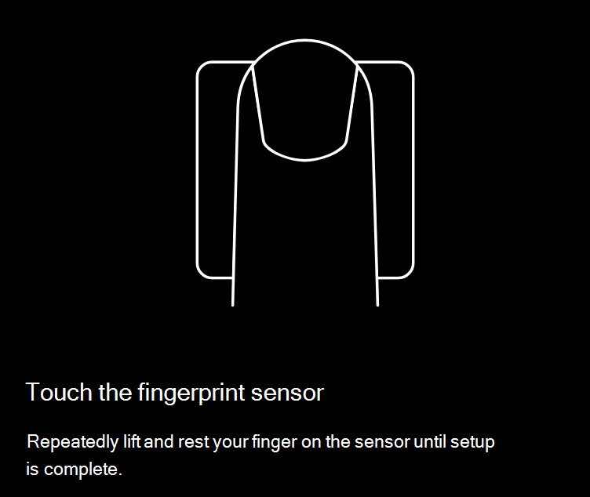
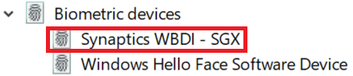

# Use a opção de desbloqueio de impressão digital Windows 10

**Habilitar Windows Hello impressão digital**

Para desbloquear Windows 10 usando sua impressão digital, você precisa configurar uma impressão digital Windows Hello adicionando (Windows aprender a reconhecer) pelo menos um dedo. 

1. Vá para **Configurações > contas > opções de login** (ou clique [aqui](ms-settings:signinoptions?activationSource=GetHelp)). As opções de login disponíveis serão listadas. Por exemplo:

    

2. Clique ou toque **Windows Hello Impressão Digital** e clique em **Configurar**. Na janela Windows Hello configuração, clique **em Iniciar**. O sensor de impressão digital será ativado e você será solicitado a colocar o dedo no sensor:

   

3. Siga as instruções, que solicitarão que você digitalizar repetidamente o dedo. Quando isso for concluído, você terá a opção de adicionar outros dedos que talvez queira usar para entrar. Na próxima vez que entrar Windows 10, você terá a opção de usar sua impressão digital para fazer isso.

**Windows Hello Impressão digital não disponível como uma opção de login**

Se Windows Hello Impressão Digital não for mostrada como uma opção nas opções de logon, isso significa que o Windows não está ciente de qualquer leitor/scanner de impressão digital anexado ao computador ou que uma política do sistema impede seu uso (se, por exemplo, seu computador for gerenciado pelo seu local de trabalho). Para solucionar problemas: 

1. Selecione o **botão Iniciar** na Barra de Tarefas e procure o Gerenciador **de Dispositivos.**

2. Clique ou toque para abrir **o Gerenciador de Dispositivos.**

3. No Gerenciador de Dispositivos, expanda dispositivos biométricos clicando em seu chevron.

   

4. Seu scanner de impressão digital deve ser listado como um dispositivo biométrico, como o scanner WBDI Synaptics:

   

5. Se o scanner de impressão digital não for mostrado e o scanner estiver integrado ao computador, vá para o site do fabricante do computador. Na seção suporte técnico para o modelo de computador, procure um driver Windows 10 um scanner que você possa instalar.

6. Se o scanner estiver separado do computador (anexado via USB), vá para o site do fabricante do scanner para encontrar e instalar um software de driver de dispositivo Windows 10 para o modelo de scanner que você tem.
