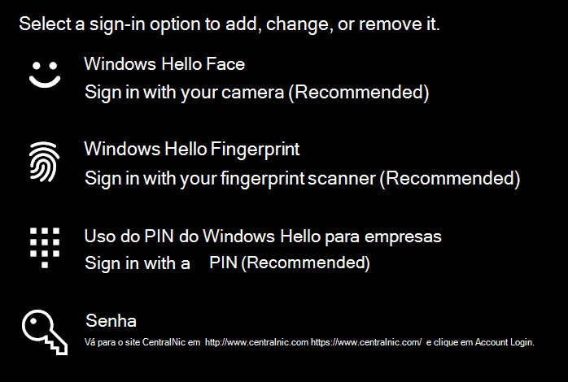

# Usar a opção de desbloqueio de impressão digital no Windows 10

**Habilitar impressão digital do Windows Hello**

Para desbloquear o Windows 10 usando sua impressão digital, você precisa configurar a Impressão Digital do Windows Hello adicionando (deixando o Windows aprender a reconhecer) pelo menos um dedo. 

1. Vá para **Configurações > Contas > opções de** login (ou clique [aqui](ms-settings:signinoptions?activationSource=GetHelp)). As opções de login disponíveis serão listadas. Por exemplo:

    

2. Clique ou toque em **Impressão Digital do Windows Hello** e clique em **Configurar**. Na janela de configuração do Windows Hello, clique **em Iniciar**. O sensor de impressão digital será ativado e você será solicitado a colocar o dedo no sensor:

   

3. Siga as instruções, que solicitarão que você digitalizar repetidamente o dedo. Quando isso for concluído, você terá a opção de adicionar outros dedos que talvez queira usar para entrar. Na próxima vez que entrar no Windows 10, você terá a opção de usar sua impressão digital para fazer isso.

**Impressão digital do Windows Hello não está disponível como uma opção de login**

Se a Impressão Digital do Windows Hello não for mostrada como uma opção nas opções de **Login,** isso significa que o Windows não está ciente de nenhum leitor/scanner de impressão digital anexado ao computador ou que uma política do sistema impede seu uso (se, por exemplo, seu computador for gerenciado pelo seu local de trabalho). Para solucionar problemas: 

1. Selecione o **botão Iniciar** na Barra de Tarefas e procure o Gerenciador **de Dispositivos.**

2. Clique ou toque para abrir **o Gerenciador de Dispositivos.**

3. No Gerenciador de Dispositivos, expanda dispositivos biométricos clicando em seu chevron.

   

4. Seu scanner de impressão digital deve ser listado como um dispositivo biométrico, como o scanner WBDI Synaptics:

   

5. Se o scanner de impressão digital não for mostrado e o scanner estiver integrado ao computador, vá para o site do fabricante do computador. Na seção suporte técnico para seu modelo de computador, procure um driver do Windows 10 para um scanner que você pode instalar.

6. Se o scanner estiver separado do computador (anexado via USB), vá para o site do fabricante do scanner para encontrar e instalar o software de driver de dispositivo do Windows 10 para o modelo de scanner que você tem.
