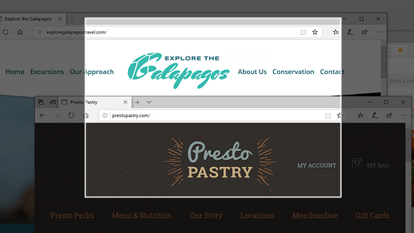
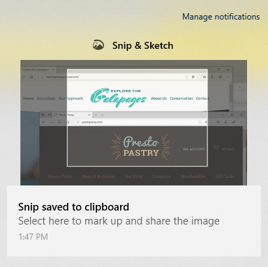

# Use o rascunho & rascunho para capturar, marcar e compartilhar imagens

O esboço de tela agora é **chamado de Snip & Sketch**. **Para fazer rapidamente um trecho**:

1. Pressione a **tecla Windows de logotipo + Shift + S**. Você verá sua tela escurecer e seu cursor exibido como uma cruz. 

2. Escolha um ponto na borda da área que você deseja copiar e clique com o botão esquerdo no cursor. 

3. Mova o cursor para realçar a área que você deseja capturar. A área que você capturar aparecerá na tela.

   

A imagem que você recortou é salva na área de transferência, pronta para colar em um email ou documento. 

**Se você quiser editar ou exibir a imagem**: 

- Clique no ícone de notificações no lado direito da barra de tarefas; em seguida, clique na imagem que você acabou de capturar. Seu trecho é aberto no aplicativo Snip & Sketch.

   
