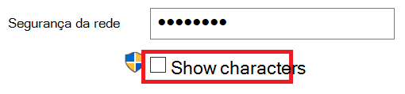

# Exibir Wi-Fi de rede no Windows 10

1. Certifique-se de que o computador windows 10 esteja conectado à rede Wi-Fi.

2. Vá para **Configurações > Rede & Internet > Status**, ou  clique ou toque aqui para nos permitir levá-lo até lá agora.)

3. Clique em **Centro de Rede e Compartilhamento**.

    

4. No **Centro de Rede e Compartilhamento,** ao lado de **Conexões,** você verá o nome da sua rede sem fio. Por exemplo, se sua rede for chamada "ABC123", você poderá ver:

    

    Clique no nome da rede sem fio para abrir a janela Wi-Fi Status. 

5. Na janela Wi-Fi Status, clique em Propriedades  **sem** fio, clique na guia Segurança e marque **Mostrar caracteres**.

    

